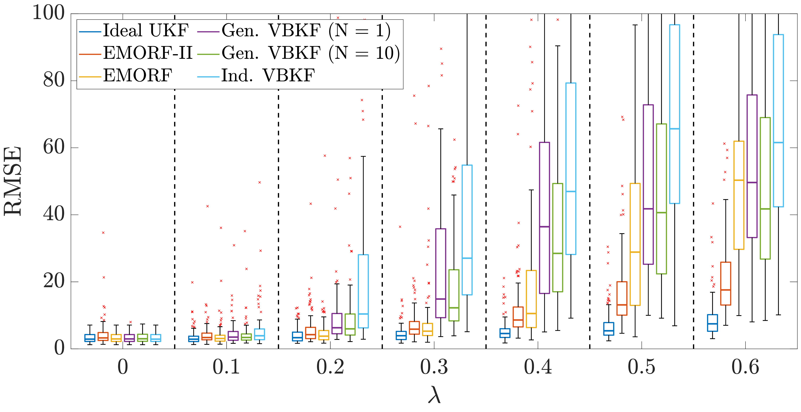
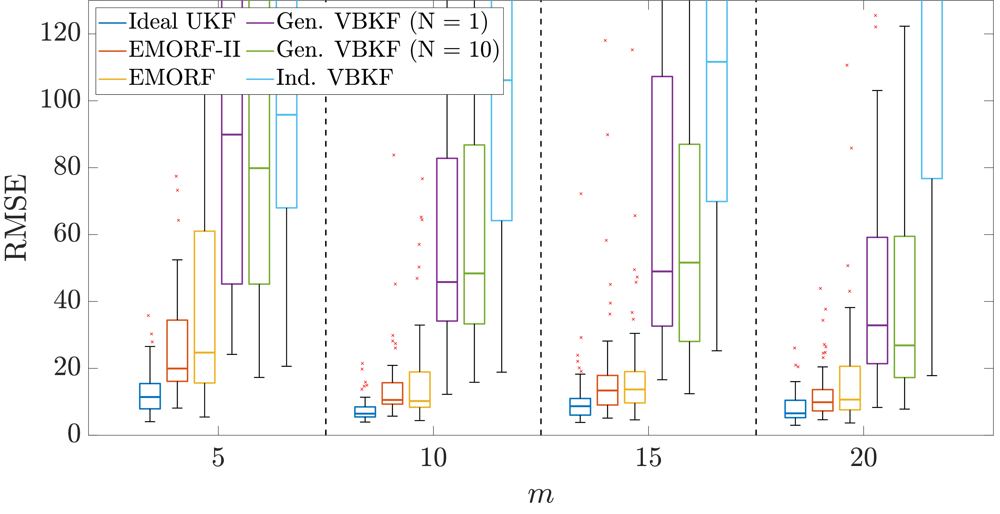
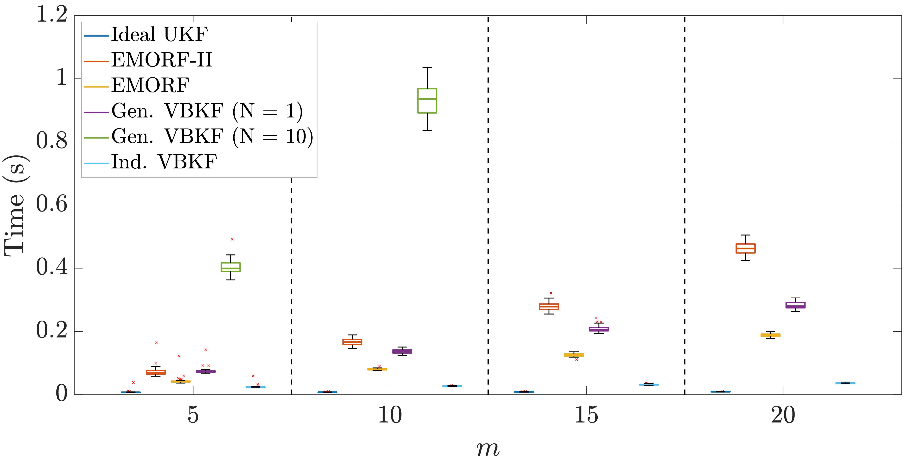

# EMORF-II: Adaptive EM-Based Outlier-Robust Filtering

This repository contains all supplementary materials for the paper:

> **EMORF-II: Adaptive EM-Based Outlier-Robust Filtering with Correlated Measurement Noise**  
> *2025 IEEE International Workshop on Machine Learning and Signal Processing*

In addition to the supplementary derivations, you’ll find:

- MATLAB implementations of our proposed algorithm (`EMORF-II.m`)  
- Reference implementations of competing filters  
- Simulation scripts to reproduce the figures in the paper  
- Example output images in the `images/` directory

---

## Repository Structure

```text
├── Paper_Code/
│   ├── EMORF-II.m
│   ├── robust_vbkf_ind_self_modular_ind_sens_nsensors_xpp.m    # Independent VBKF
│   ├── robust_vbkf_self_modular_nsensors_10_xpp.m              # General VBKF (N = 10)
│   ├── robust_vbkf_self_modular_nsensors_1_xpp.m               # General VBKF (N = 1)
│   ├── ukf_ideal_self_modular_nsensors_xpp.m                   # Ideal UKF
│   ├── robust_EMORF_self_modular_ind_sens_nsensors_xpp.m       # EMORF-I
│   ├── EMORF_II_Performance_Comparisons.m                      # Fig. 2
│   ├── EMORF_II_Increasing_Sensors_Comparison.m                 # Fig. 3
│   └── EMORF_II_Time_Comparison.m                               # Fig. 4
│
├── images/
│   ├── Performance_Comparison.jpg
│   ├── Performance_Comparison_Increasing_m.jpg
│   └── Computation_Time_Comparison.jpg
│
├── Supplementary_Material_EMORF_II.pdf
└── README.md

```


---

## Prerequisites

- MATLAB R2020a or later  
- [daboxplot](https://www.mathworks.com/matlabcentral/fileexchange/74851-daboxplot) — place this folder anywhere on your MATLAB path.

---

## Usage

1. **Clone this repository**  
   ```bash
   git clone https://anonymous.4open.science/r/EMORF-II-Paper-3EF7.git
   cd EMORF-II
2. addpath('path/to/daboxplot')
3. Run EMORF_II_Performance_Comparisons.m

4. Run EMORF_II_Increasing_Sensors_Comparison.m

5. Run EMORF_II_Time_Comparison.m



## Method Implementations

- `EMORF-II.m` 
  Our proposed adaptive EM-based outlier-robust filter.

- **Comparative Filters**  
  - `robust_vbkf_ind_self_modular_ind_sens_nsensors_xpp.m`  
    Independent VB Kalman filter  
  - `robust_vbkf_self_modular_nsensors_10_xpp.m`  
    General VB Kalman filter (N = 10)  
  - `robust_vbkf_self_modular_nsensors_1_xpp.m`  
    General VB Kalman filter (N = 1)  
  - `ukf_ideal_self_modular_nsensors_xpp.m`  
    Ideal Unscented Kalman filter  
  - `robust_EMORF_self_modular_ind_sens_nsensors_xpp.m`  
    The original EMORF-I algorithm  


If you use this code in your research, please cite:
TBD


